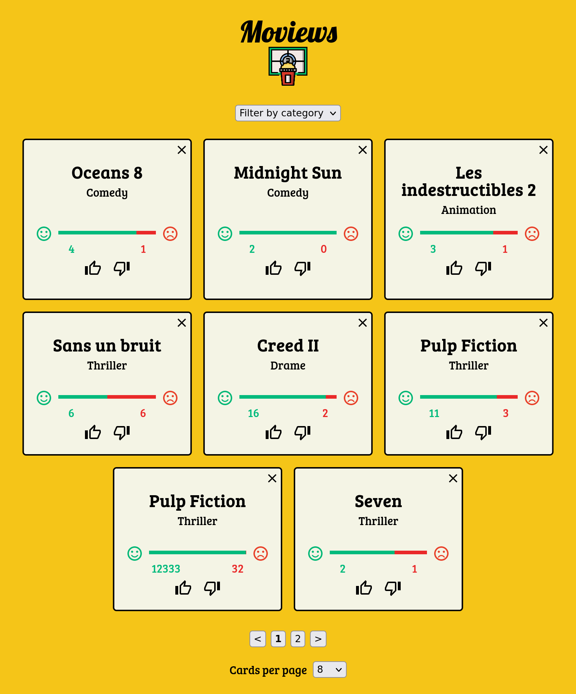

# react-interview-movies

To install the project:

1 - Install Yarn: https://yarnpkg.com/
2 - Install the project dependencies: yarn install
3 - Run the project: yarn start

To read the code with VS Code: https://github1s.com/Liza-T-XLS/To-Do-Typewriter

Available at: https://moviews2021.netlify.app/

#javascript #react #redux #scss #responsive

